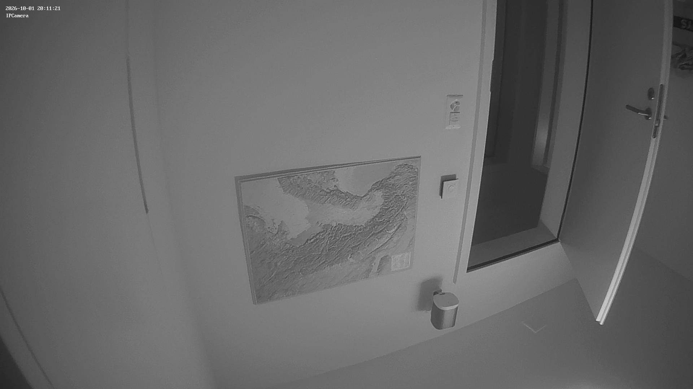

# pnzeo

Take pictures and movies from a **Pnzeo W3** IP camera (and other
`IPCamera-Web` / ismartol-platform cameras) from Python — standard library
only, no `ffmpeg` or `opencv`.

The camera exposes a standard mjpg-streamer HTTP interface behind Basic auth:

| Endpoint                   | Returns                                   |
| -------------------------- | ----------------------------------------- |
| `/media/?action=snapshot`  | one JPEG (1920×1080)                       |
| `/media/?action=stream`    | multipart MJPEG (~9 fps at 1080p)         |

Only port 80 is open — there is no RTSP.

## Credentials

The **device web login** is user `admin` with an **empty password**. This is
separate from the password set in the phone app, which is the cloud-account
credential and does not apply to the local web interface.

## Install

No dependencies. Clone the repo, or just copy `pnzeo_cam.py`.

```bash
git clone https://github.com/iot49/pnzeo.git
cd pnzeo
```

## Command line

```bash
python3 pnzeo_cam.py snap                 # -> snapshot_<timestamp>.jpg
python3 pnzeo_cam.py snap -o front.jpg
python3 pnzeo_cam.py record 10            # 10 s -> clip_<timestamp>.avi
python3 pnzeo_cam.py record 10 -o door.avi
```

### Low-light color: the magenta cast

In dim light the color frames have a magenta tint. The camera's IR-cut filter
works (daylight is normal color), but in low light the infrared contaminates
the color channels, and that is not reversible — the true colors are gone.
`--gray` desaturates to a clean black-and-white, the same thing the phone app's
B&W toggle does. It needs Pillow, so run it through `uv`:

```bash
uv run --with pillow pnzeo_cam.py snap --gray
uv run --with pillow pnzeo_cam.py record 10 --gray
```

The snapshot and record commands themselves have no dependencies; only
`--gray` pulls in Pillow.



The camera address, user, and password default to `192.168.178.58`, `admin`,
and empty. Override per command:

```bash
python3 pnzeo_cam.py --host 192.168.1.50 --user admin --password secret snap
```

or with environment variables `PNZEO_HOST`, `PNZEO_USER`, `PNZEO_PASS`.

## Library

```python
from pnzeo_cam import Camera

cam = Camera("192.168.178.58")        # user="admin", password="" by default
cam.snapshot("front.jpg")
cam.record("door.avi", seconds=10)    # Motion-JPEG AVI, plays in QuickTime/VLC

for jpg in cam.frames():              # raw JPEG bytes from the MJPEG stream
    process(jpg)
```

## Recordings

`record()` writes a **Motion-JPEG AVI** with a minimal built-in writer, so no
external tools are needed. The file plays in QuickTime, VLC, and `ffmpeg`. Each
frame keeps the camera's native resolution; the frame rate is measured from the
capture and written into the container.

## License

[MIT](LICENSE)
